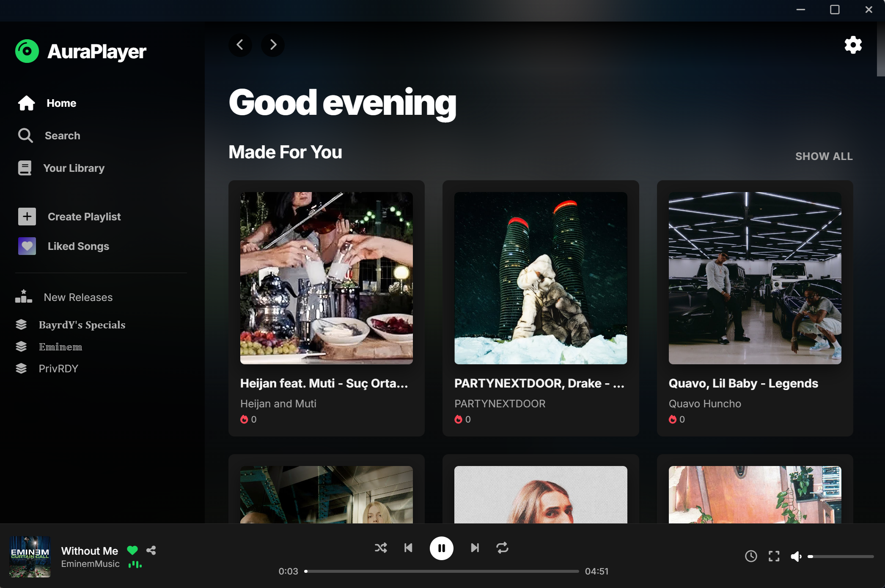
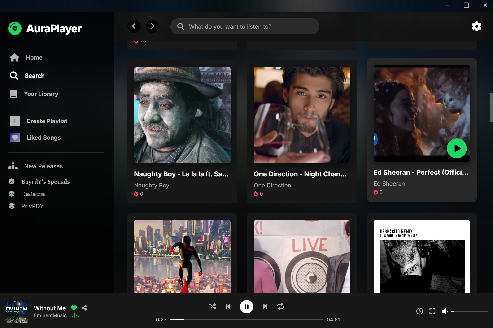
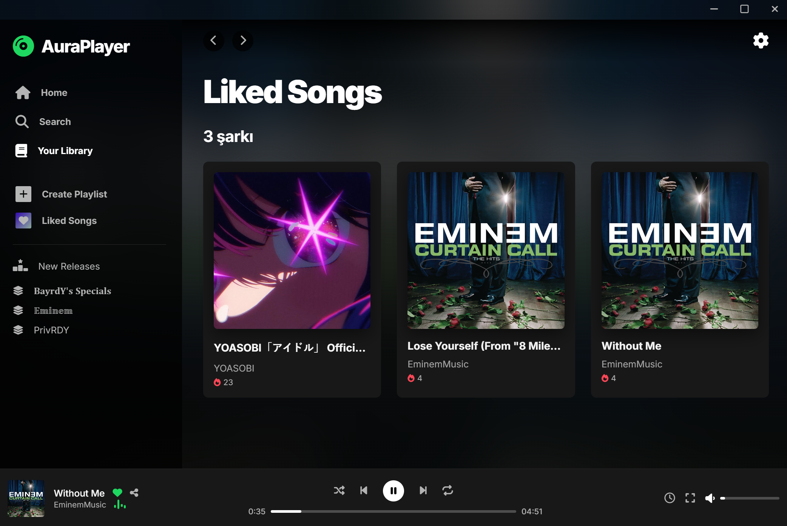
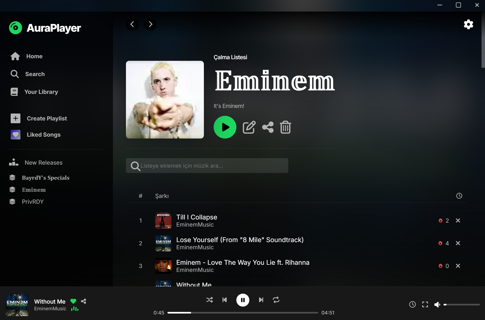
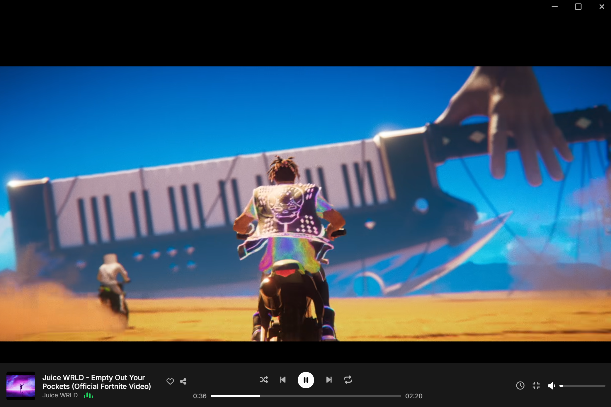

# AuraPlayer

AuraPlayer is a desktop music player built with Electron, featuring a custom Spotify-like UI. It functions as a wrapper for the YouTube IFrame API, utilizing local JSON storage for metadata and playlist management to bypass external API rate limits. 

This project was developed strictly for educational purposes and as a UI/UX portfolio piece.

## Technical Architecture

* **Frontend:** Vanilla HTML, CSS (Glassmorphism UI), and JavaScript.
* **Backend/Framework:** Electron.js (Node.js integration).
* **Data Layer:** Static `db.json` file for track metadata storage.
* **Media Engine:** YouTube IFrame API.
* **IPC Communication:** ContextBridge with `nodeIntegration: false` for secure renderer-main process messaging.

## Features

* **Custom Frameless UI:** Replaces default OS window controls with a custom drag-region and CSS-based controls.
* **Zero-API Quota Design:** Uses a pre-scraped local JSON database instead of live YouTube Data API queries.
* **Deep Linking:** Implements a custom `auraplayer://` protocol handler for sharing custom playlists locally.
* **Multilingual Support:** UI localization for Turkish, English, German, French, Spanish, and Russian.
* **Crossfade Simulation:** Basic volume-ramping logic between two hidden YouTube IFrames.

## Disclaimer & Legal

AuraPlayer is a proof-of-concept. It does not host any audio files or bypass DRM. Media playback relies on the official YouTube embedded player. This repository contains only the application shell and logic; it does not distribute copyrighted material.

## Installation

1. Download the latest executable from the Releases page.
2. Run the installer.

---

## UI Screenshots

### Main

### Search

### Likes

### Playlist

### Video

---

# 🎵 AuraPlayer: Performance-Oriented Architectural Decisions with Vanilla JS and Electron

AuraPlayer is a performance-oriented application developed to optimize media playback processes in a desktop environment. This document details the project's core engineering problems and the architectural decisions made to solve them.

## 📑 Table of Contents
1. [Introduction and Project Context](#1-introduction-and-project-context)
2. [Seamless Experience: Crossfade Algorithm with Dual Players](#2-seamless-experience-crossfade-algorithm-with-dual-players)
3. [DOM Performance and Resource Management: Lazy Loading with Intersection Observer](#3-dom-performance-and-resource-management-lazy-loading-with-intersection-observer)
4. [Data Processing: Weighted Search Mechanism](#4-data-processing-weighted-search-mechanism)
5. [OS Integration and Data Serialization: Deep Linking](#5-os-integration-and-data-serialization-deep-linking)
6. [Conclusion and Key Takeaways](#6-conclusion-and-key-takeaways)

---

## 🚀 1. Introduction and Project Context

The primary engineering goal of the project is to provide a hardware-friendly, uninterrupted streaming experience without relying on resource-heavy web browsers:
* **📉 Low Memory Footprint**
* **⚙️ Minimum CPU Usage**
* **▶️ Uninterrupted Media Streaming:** Stable audio and video transmission via the YouTube IFrame API.

### ⚡ Why Vanilla JS? (A Framework-less Approach)
Instead of using frameworks like React, Vue, or Angular that involve a Virtual DOM and complex state management, **Vanilla JS (Pure JavaScript)** was chosen directly for the application's architecture.
* **Fast DOM Manipulation:** Relying on direct DOM interventions.
* **Event Listener Optimization:** The need to respond to the external media player's real-time events without latency.
* **Zero-Dependency:** Minimizing runtime delays by eliminating dependencies.

### 🛡️ Desktop Integration and Security with Electron.js
* 🔒 **Node.js Isolation:** Node.js integration is completely disabled in the renderer process (`nodeIntegration: false`).
* 🧱 **Context Isolation:** Data flow between the main process and renderer processes is isolated by enabling `contextIsolation`.
* 🔌 **Controlled IPC Communication:** Frameless window controls and deep linking protocols are entrusted solely to specific **IPC** channels opened via `preload.js`.

---

## 🔀 2. Seamless Experience: Crossfade Algorithm with Dual Players

When the YouTube IFrame API is used via a single instance, silence gaps during track changes are inevitable. To solve this problem, **two separate IFrame player instances are kept simultaneously in memory**. The algorithm works in the following steps:

1. **Preloading:** When a new track is triggered, the new video ID is assigned to the inactive player, and loading begins with the volume set to `0`.
2. **Linear Interpolation:** The transition duration (e.g., 3000 ms) is divided into specific steps using a `setInterval`-based linear interpolation mechanism.
3. **Crossfade:** While the active player's volume is lowered, the new player's volume is gradually increased to the target volume.
4. **Visual Synchronization:** The `opacity` values of the IFrame containers are cross-faded using CSS `transition` rules.
5. **Resource Cleanup:** Once the transition is complete, the old player is completely stopped (`pauseVideo`).

---

## 👁️ 3. DOM Performance and Resource Management: Lazy Loading with Intersection Observer

Rendering large datasets into the DOM all at once blocks the browser's main thread. To overcome this bottleneck, **data chunking** and **lazy loading** were implemented:

* 📦 **Chunking:** Instead of rendering all data at once, it is divided into chunks of 50 items.
* 🛑 **Sentinel Node:** An invisible "sentinel" DOM node is placed at the very end of the list.
* ⚡ **Asynchronous Observation:** Instead of performance-heavy `scroll` listeners, the asynchronous `IntersectionObserver` API is used.
* 🔄 **Trigger and Render:** The moment the sentinel node enters the user's viewport, the observer is triggered, and the next 50 items are appended to the DOM.
* ♻️ **Cycle Update:** The original sentinel is removed, and a new sentinel is added to the new end of the list to continue observation dynamically.

---

## 🔍 4. Data Processing: Weighted Search Mechanism

A standard `includes()`-based linear search does not always place the most relevant result at the top. To ensure intent-based matching, results are filtered into **three different weight categories**:

1. 🎯 **Exact Matches:** Cases where the query perfectly matches the track or artist name.
2. 🚀 **Starts With Matches:** Cases where the track name starts with the query or the query is included as a full word.
3. 🧩 **Fuzzy/Loose Matches:** Flexible matches where the query string is found anywhere within the text as a substring.

**Working Principle:** The entire dataset is scanned in a single loop (`forEach`). Matching items are assigned to their respective arrays, and at the end of the loop, they are concatenated in the order of `[...exactMatches, ...startsWithMatches, ...fuzzyMatches]` using the **Spread Operator**. This produces results with `O(n)` complexity without needing a costly sorting algorithm.

---

## 🔗 5. OS Integration and Data Serialization: Deep Linking

To allow the sharing of playlists, a custom OS protocol (`auraplayer://`) was defined and integrated using the `setAsDefaultProtocolClient` method. Data transfer occurs directly via the URL payload without a centralized server (backend).

To avoid exceeding OS URL length limits (e.g., 6000 characters), **serialization and dynamic size control** are applied:

1. 📦 The data to be shared is transferred into a lightweight JSON object.
2. 🔏 It is converted into a secure Base64 format using `encodeURIComponent`, `unescape`, and `btoa()`.
3. 📏 The total length of the generated URI string is checked.
4. ✂️ **Asymmetric Data Reduction:** If the URL exceeds the critical limit, the **cover photo** data, which carries the most weight, is removed from the object, and the data is re-serialized. This guarantees that the core function (transferring the playlist) works under all conditions.

---

## 🏆 6. Conclusion and Key Takeaways

AuraPlayer was built as a strong alternative to external library dependency (dependency hell). The measurable engineering achievements are:

* 🧠 **Memory Optimization:** By keeping the number of nodes in the DOM constant, memory consumption became independent of the list size.
* ⚡ **Minimum Processing Cost:** The overhead of Virtual DOM calculations was eliminated, bringing interface response times closer to zero.
* ⏱️ **Zero-Latency Processing:** Algorithms are executed entirely client-side, pushing network latency out of the system.
* 🛡️ **Sustainable Dependency Management:** Thanks to the zero-dependency principle, maintenance costs arising from external library updates were reduced to zero.
